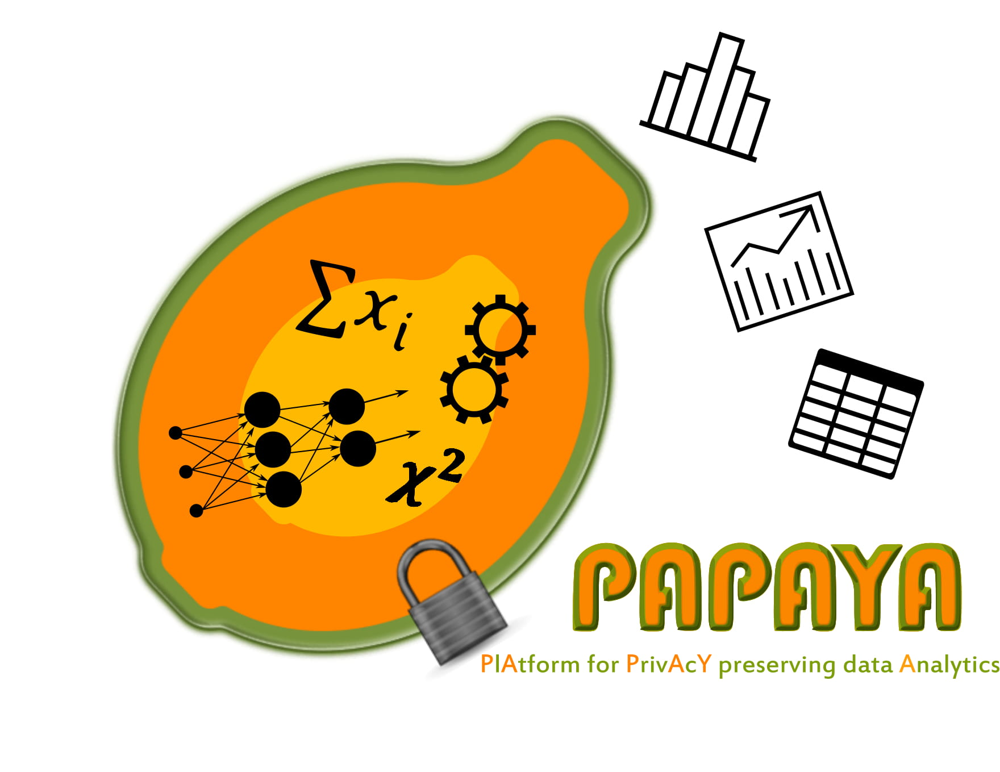

# Papaya Platform Dashboard
### Developed as part of EU funded [PAPAYA Project: PlAtform for PrivAcY preserving data Analytics](https://www.papaya-project.eu/)

## Platform Dashboard 
The platform dashboard is implemented as a Flask Web application hosted in a container that is supposed to run on the IBM’s K8s cluster. 
The dashboard provides the following functionalities: 
-  Present a list of services provided by the platform (Service’s Catalog)
-  Allows service providers to Add/Edit/Delete services
-  Create/Deploy/Delete application (a dedicated instance of each of the provided services)
-  Allow application’s owners to monitor the flow of the application by presenting operational logs

## Deployment

This project has been deployed on IBM Cloud Kubernetes Service (IKS) <br>
### 1. Create a Docker Image
1.1 create docker image `docker build --tag papays_server .` <br>
1.2 [Getting started with the IBM Cloud CLI](https://cloud.ibm.com/docs/cli?topic=cli-getting-started#idt-prereq) <br>
1.3 push the created docker image to [IBM's Container Registry](https://cloud.ibm.com/docs/Registry?topic=Registry-getting-started)

### 2. On the IKS the following should be performed:
2.1 Create a namespace 'papaya' <br>
2.2 Create a dedicated K8s Secret named `platform-admin` for the platform dashboard administrator user. This secret should define the following variables:<br>
```
    ADMIN_USERNAME
    ADMIN_PASSWORD
```
2.3 Create and Deploy Kibana and Elastic Search instances on IKS <br>
2.4 Create Secrete and Instance for IAM-(point to D4.3 deliverable) client, the following environment variables should be defined:
```bash
    IAM_CLIENT_ID
    IAM_URL
    IAM_CLIENT_SECRET 
    
```

### 3. Fill the required environment variables in K8s yaml and configuration files:
    papaya_server/k8s/papaya-deployment.yaml
    papaya_server/k8s/papaya-ingress.yaml
    papaya_server/config.py


### 4. Deploy Platform Dashboard on IBM's K8s cluster 
    
    kubectl apply -f papaya_server/k8s
    


This project is partially based on [AppSeed](https://appseed.us/)

